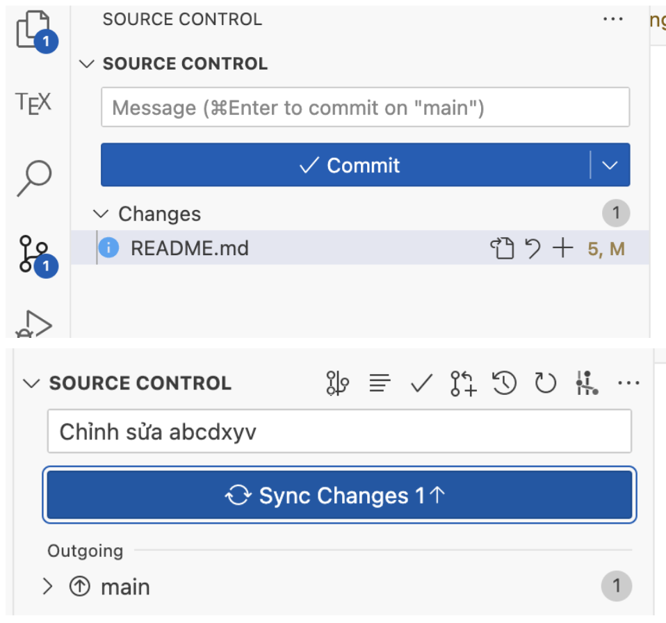

# Thư nhớ đọc ghi chú:
- Khi Chỉnh sửa File, **XIN HÃY NHỚ** là trước tiên phải phân ``nhánh phụ``, sau đó chỉnh sửa trên nhánh phụ đến khi nào thấy ok rồi hãy nhập nhánh phụ vào ``nhánh main`` ! 
- Mọi Chỉnh sửa xin hãy ghi lời nhắn ở ô ``Message`` trước khi đồng bộ thay đổi (Sync Changes)!
**Ảnh minh hoạ**
